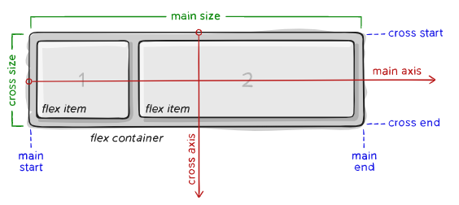
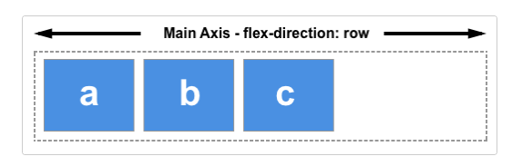
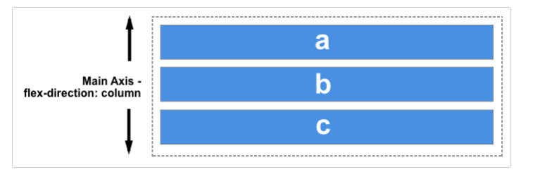
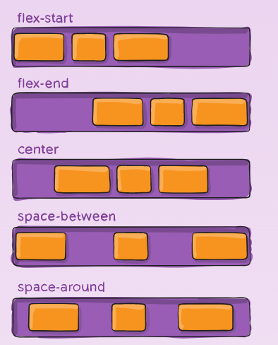
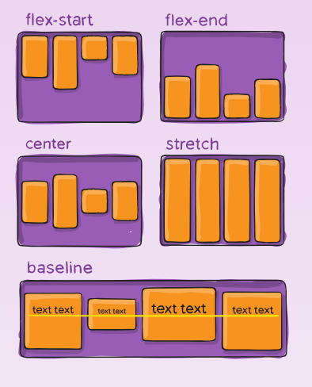
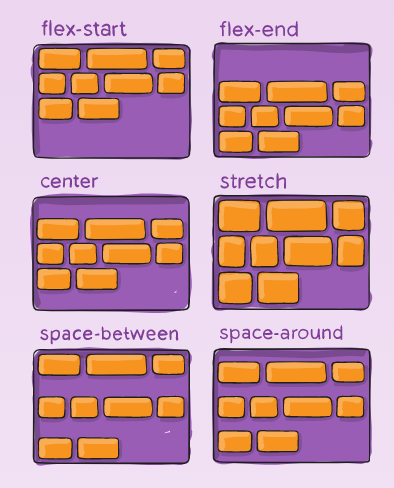
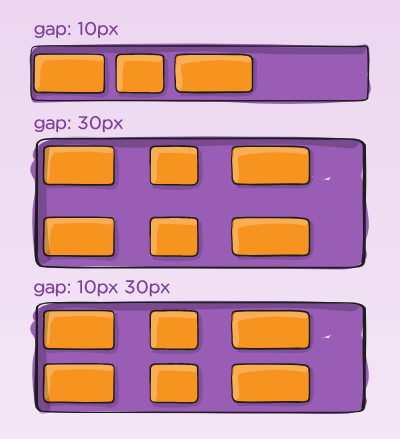
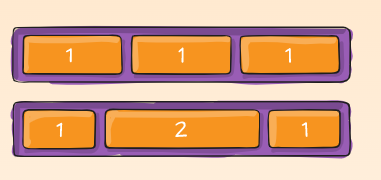
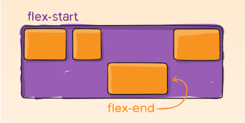

# CSS Flexbox Layout Module

The Flexbox Layout (Flexible Box) module aims at providing a more efficient way to lay out, align and distribute space among items in a container, even when their size is unknown and/or dynamic (thus the word “flex”).

## Before the Flexbox Layout module, there were four layout modes:

- Block, for sections in a webpage.
- Inline, for text.
- Table, for two-dimensional table data.
- Positioned, for explicit position of an element.

The Flexible Box Layout Module, makes it easier to design flexible responsive layout structure without using float or positioning.

## Working with the Flexbox Layout Module:-

When working with flexbox you need to think in terms of two axes — the main axis and the cross axis. The main axis is defined by the flex-direction property, and the cross axis runs perpendicular to it.

## Flexbox properties:

### Properties for the Parent (flex container):

## 1 . display :

This defines a flex container; inline or block depending on the given value. It enables a flex context for all its direct children.

    .container {
    display: flex; /* or inline-flex */
    }

## 2. flex-direction:

The main axis is defined by flex-direction, which has four possible

values:

    row
    row-reverse
    column
    column-reverse

Syntax:

    .container {
    flex-direction: row | row-reverse | column | column-reverse;
    }

see below image better understanding.

## 3. flex-wrap :

By default, flex items will all try to fit onto one line. You can change that and allow the items to wrap as needed with this property.

values:

    nowrap (default): all flex items will be on one line

    wrap: flex items will wrap onto multiple lines, from top to bottom.

    wrap-reverse: flex items will wrap onto multiple lines from bottom to top.

Syntax :

    .container {
    flex-wrap: nowrap | wrap | wrap-reverse;
    }

## 4. flex-flow :

This is a shorthand for the flex-direction and flex-wrap properties, which together define the flex container’s main and cross axes. The default value is row nowrap.

values:

    /* flex-flow: <'flex-direction'> and <'flex-wrap'> */
    flex-flow: row nowrap;
    flex-flow: column wrap;
    flex-flow: column-reverse wrap-reverse;

Syntax :

    .container {
    flex-flow: column wrap;
    }

## 5. justify-content :

The justify-content property aligns the flexible container's items when the items do not use all available space on the main-axis (horizontally).

values :

    flex-start (default): items are packed toward the start of the flex-direction.

    flex-end: items are packed toward the end of the flex-direction.

    center: items are centered along the line.

    space-between: items are evenly distributed in the line; first item is on the start line, last item on the end line.

    space-around:Items will have space before, between, and after them

Syntax:

    .container {
    justify-content: flex-start | flex-end | center | space-between | space-around | space-evenly | start | end | left | right ... + safe | unsafe;
    }

See below image better understanding.

## 6. align-items :

The align-items property specifies the default alignment for items inside the flexible container.

Value :

    stretch	Default:Items are stretched to fit the container.

    center:Items are positioned at the center of the container.

    flex-start:Items are positioned at the beginning of the container.

    flex-end:Items are positioned at the end of the container.

    baseline:Items are positioned at the baseline of the container.

System :

    .container {
    align-items: stretch | flex-start | flex-end | center | baseline | first baseline | last baseline | start | end | self-start | self-end + ... safe | unsafe;
    }

See below image better understanding.

## 7. align-content :

The align-content property modifies the behavior of the flex-wrap property. It is similar to align-items, but instead of aligning flex items, it aligns flex lines.

<i>Note: There must be multiple lines of items for this property to have any effect!</i>

Values :

    stretch:Default value. Lines stretch to take up the remaining space.

    center:Lines are packed toward the center of the flex container.

    flex-start:Lines are packed toward the start of the flex container.

    flex-end:Lines are packed toward the end of the flex container.

    space-between:Lines are evenly distributed in the flex container.

    space-around:Lines are evenly distributed in the flex container, with half-size spaces on either end.

Syntax :

    .container {
    align-content: flex-start | flex-end | center | space-between | space-around | space-evenly | stretch | start | end | baseline | first baseline | last baseline + ... safe | unsafe;
    }

See below image better understanding.

## 8. gap, row-gap, column-gap :

The gap property explicitly controls the space between flex items. It applies that spacing only between items not on the outer edges.

Values:

    gap:

    row-gap:

    column-gap:

Syntax :

    .container {
    display: flex;
    ...
    gap: 10px;
    gap: 10px 20px; /* row-gap column gap */
    row-gap: 10px;
    column-gap: 20px;
    }

See below image better understanding.

# Properties for the Children (flex items):

## 1. order :

By default, flex items are laid out in the source order. However, the order property controls the order in which they appear in the flex container.

Values:

    order:

Syntax :

     .item {
    order: 5; /* default is 0 */
    }

## 2. flex-grow/shrink:

This defines the ability for a flex item to grow if necessary. It accepts a unitless value that serves as a proportion.

This defines the ability for a flex item to shrink if necessary.

Values :

    flex-grow:
    flex-Shrink:

Syntax :

    .item {
    flex-grow: 4; /* default 0 */
    }

    .item {
    flex-shrink: 3; /* default 1 */
    }

See below image better understanding.

## 3. align-self :

This allows the default alignment (or the one specified by align-items) to be overridden for individual flex items.

Values :

    align-self:

Syntax :

    .item {
    align-self: auto | flex-start | flex-end | center | baseline | stretch;
    }

See below image better understanding.

# Thank You..!
